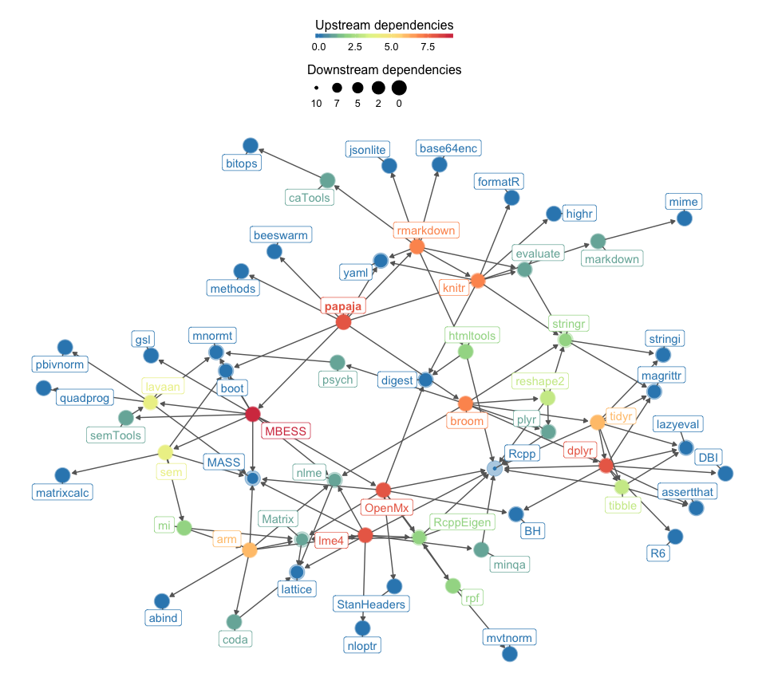
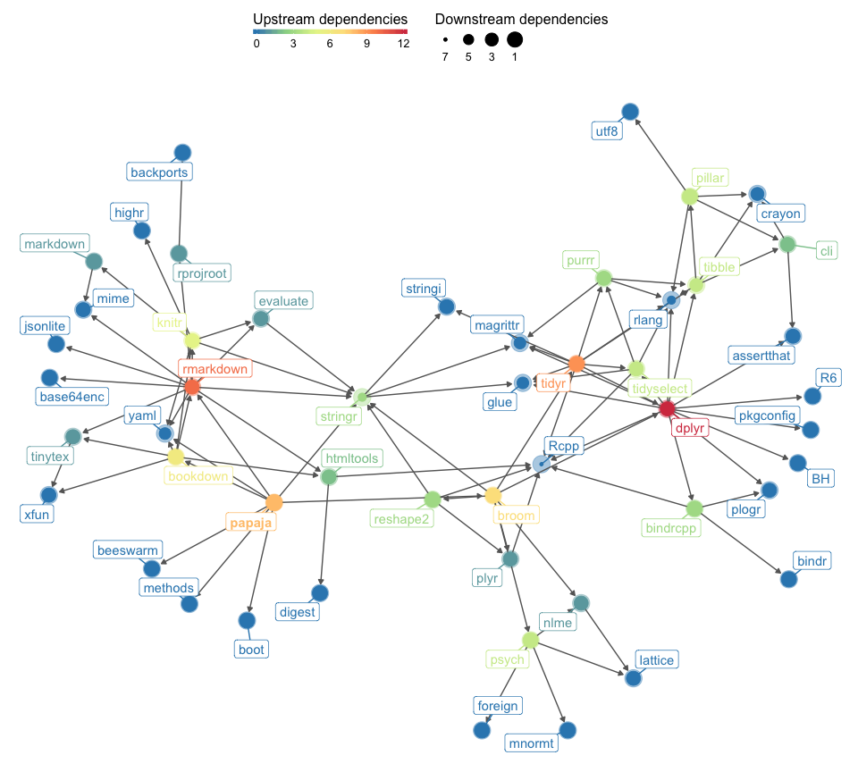

papaja: Prepare APA journal articles with R Markdown
================

<!-- README.md is generated from README.Rmd. Please edit that file -->

------------------------------------------------------------------------

[](http://www.repostatus.org/#wip) [](https://travis-ci.org/crsh/papaja)

`papaja` is a R-package in the making including a [R Markdown](http://rmarkdown.rstudio.com/) template that can be used with (or without) [RStudio](http://www.rstudio.com/) to produce documents, which conform to the American Psychological Association (APA) manuscript guidelines (6th Edition). The package uses the LaTeX document class [apa6](http://www.ctan.org/pkg/apa6) and a .docx-reference file, so you can create PDF documents, or Word documents if you have to. Moreover, `papaja` supplies R-functions that facilitate reporting results of your analyses in accordance with APA guidelines.

**Note, at this point `papaja` is in active development and should be considered alpha. If you experience any problems, please [open an issue](https://github.com/crsh/papaja/issues) on Github.**

Examples
--------

Take a look at the [.Rmd](https://github.com/crsh/papaja/blob/master/example/example.Rmd) of the example manuscript in the folder `example` and the resulting [.pdf](https://raw.githubusercontent.com/crsh/papaja/master/example/example.pdf). The example document also contains some basic instructions.

Installation
------------

To enable `papaja`'s full set of features you need either an up-to-date version of [RStudio](http://www.rstudio.com/) or [pandoc](http://johnmacfarlane.net/pandoc/) and a [TeX](http://de.wikipedia.org/wiki/TeX) distribution (e.g., [MikTeX](http://miktex.org/) for Windows, [MacTeX](https://tug.org/mactex/) for Mac, or [TeX Live](http://www.tug.org/texlive/) for Linux).

Please refer to the [`papaja` manual](https://crsh.github.io/papaja_man/introduction.html#getting-started) for detailed installation instructions.

`papaja` is not yet available on CRAN but you can install it from this repository:

``` r
# Install devtools package if necessary
if(!"devtools" %in% rownames(installed.packages())) install.packages("devtools")

# Install the stable development verions from GitHub
devtools::install_github("crsh/papaja")

# Install the latest development snapshot from GitHub
devtools::install_github("crsh/papaja@devel")
```

How to use papaja
-----------------

Once `papaja` is installed, you can select the APA template when creating a new Markdown file through the RStudio menus.


If you want to add citations specify your BibTeX-file in the YAML front matter of the document (`bibliography: my.bib`) and you can start citing. If necessary, have a look at R Markdown's [overview of the citation syntax](http://rmarkdown.rstudio.com/authoring_bibliographies_and_citations.html). You may also be interested in [citr](https://github.com/crsh/citr), an R Studio addin to swiftly insert Markdown citations.

### Helper functions to report analyses

The functions `apa_print()` and `apa_table()` facilitate reporting results of your analyses. Take a look at the [.Rmd](https://github.com/crsh/papaja/blob/master/example/example.Rmd) of the example manuscript in the folder `example` and the resulting [.pdf](https://raw.githubusercontent.com/crsh/papaja/master/example/example.pdf).

Drop a supported analysis result, such as an `htest`- or `lm`-object, into `apa_print()` and receive a list of possible character strings that you can use to report the results of your analysis.

``` r
my_lm <- lm(Sepal.Width ~ Sepal.Length + Petal.Width + Petal.Length, data = iris)
apa_lm <- apa_print(my_lm)
```

One element of this list is `apa_lm$table` that, in the case of an `lm`-object, will contain a complete regression table. Pass `apa_lm$table` to `apa_table()` to turn it into a proper table in your PDF or Word document (remember to set the chunk option `results = "asis"`).

``` r
apa_table(apa_lm$table, caption = "Iris regression table.")
```

<!-- GitHub markdown doesn't support MathJax -->

------------------------------------------------------------------------

Table. *Iris regression table.*

| Predictor    |  *b*  |      95% CI      | *t(146)* |    *p*    |
|:-------------|:-----:|:----------------:|:--------:|:---------:|
| Intercept    |  1.04 |  \[0.51, 1.58\]  |   3.85   | &lt; .001 |
| Sepal Length |  0.61 |  \[0.48, 0.73\]  |   9.77   | &lt; .001 |
| Petal Width  |  0.56 |  \[0.32, 0.80\]  |   4.55   | &lt; .001 |
| Petal Length | -0.59 | \[-0.71, -0.46\] |   -9.43  | &lt; .001 |

------------------------------------------------------------------------

`papaja` currently provides methods for the following object classes:

| A-B           | B-H               | L-S               | S-Z              |
|:--------------|:------------------|:------------------|:-----------------|
| afex\_aov     | BFBayesFactorList | list              | summary\_emm     |
| anova         | BFBayesFactorTop  | lm                | summary.glht     |
| Anova.mlm     | emmGrid           | lsmobj            | summary.glm      |
| aov           | glht              | summary.Anova.mlm | summary.lm       |
| aovlist       | glm               | summary.aov       | summary.ref.grid |
| BFBayesFactor | htest             | summary.aovlist   |                  |

### Plot functions

Be sure to also check out `apa_barplot()`, `apa_lineplot()`, and `apa_beeplot()` (or the general function `apa_factorial_plot()`) if you work with factorial designs:

``` r
apa_factorial_plot(
  data = npk
  , id = "block"
  , dv = "yield"
  , factors = c("N", "P", "K")
  , ylim = c(0, 80)
  , level = .34
  , las = 1
  , ylab = "Yield"
  , plot = c("swarms", "lines", "error_bars", "points")
)
```



If you prefer creating your plots with `ggplot2` try `theme_apa()`.

### Using papaja without RStudio

Don't use RStudio? No problem. Use the `rmarkdown::render` function to create articles:

``` {r}
# Create new R Markdown file
rmarkdown::draft(
  "mymanuscript.Rmd"
  , "apa6"
  , package = "papaja"
  , create_dir = FALSE
  , edit = FALSE
)

# Render manuscript
rmarkdown::render("mymanuscript.Rmd")
```

Contribute
----------

Like `papaja` and want to contribute? Take a look at the [open issues](https://github.com/crsh/papaja/issues) if you need inspiration. Other than that, there are many output objects from analysis methods that we would like `apa_print()` to support. Any new S3/S4-methods for this function are always appreciated (e.g., `factanal`, `fa`, `lavaan`, `lmer`, or `glmer`).

Papers written with papaja
--------------------------

Although `papaja` is not yet on CRAN and is still undergoing a lot of changes, there are peer-reviewed publications that use it. If you have published a paper that was written with `papaja`, you can add the reference to the [public Zotero group](https://www.zotero.org/groups/2202906/papaja) yourself or send it to me.

Aust, F., & Edwards, J. D. (2016). Incremental validity of Useful Field of View subtests for the prediction of instrumental activities of daily living. *Journal of Clinical and Experimental Neuropsychology*, *38*(5), 497–515. <https://doi.org/10.1080/13803395.2015.1125453>

Aust, F., Haaf, J. M., & Stahl, C. (2018). A memory-based judgment account of expectancy-liking dissociations in evaluative conditioning. *Journal of Experimental Psychology: Learning, Memory, and Cognition*. <https://doi.org/10.1037/xlm0000600> (R Markdown and data files: https://osf.io/vnmby/)

Barth, M., Stahl, C., & Haider, H. (2018). Assumptions of the process-dissociation procedure are violated in implicit sequence learning. *Journal of Experimental Psychology: Learning, Memory, and Cognition*. <https://doi.org/10.1037/xlm0000614> (R Markdown and data files: https://github.com/methexp/pdl2)

Beaton, D., Sunderland, K. M., Levine, B., Mandzia, J., Masellis, M., Swartz, R. H., … Strother, S. C. (2018). Generalization of the minimum covariance determinant algorithm for categorical and mixed data types. *bioRxiv*. <https://doi.org/10.1101/333005>

Bergmann, C., Tsuji, S., Piccinini, P. E., Lewis, M. L., Braginsky, M., Frank, M. C., & Cristia, A. (2018). Promoting Replicability in Developmental Research Through Meta-analyses: Insights From Language Acquisition Research. *Child Development*. <https://doi.org/10.1111/cdev.13079> (R Markdown and data files: https://osf.io/uhv3d/)

Buchanan, E. M., & Scofield, J. E. (2018). Methods to detect low quality data and its implication for psychological research. *Behavior Research Methods*. <https://doi.org/10.3758/s13428-018-1035-6> (R Markdown and data files: https://osf.io/x6t8a/)

Buchanan, E., & Scofield, J. (2018). Bulletproof Bias? Considering the Type of Data in Common Proportion of Variance Effect Sizes. *PsyArXiv*. <https://doi.org/10.17605/osf.io/cs4vy> (R Markdown and data files: https://osf.io/urd8q/)

Buchanan, E., & Valentine, K. (2018). An Extension of the QWERTY Effect: Not Just the Right Hand, Expertise and Typability Predict Valence Ratings of Words. *PsyArXiv*. <https://doi.org/10.31219/osf.io/k7dx5> (R Markdown and data files: https://osf.io/zs2qj/)

Buchanan, E., Foreman, R., Johnson, B., Pavlacic, J., Swadley, R., & Schulenberg, S. (2018). Does the Delivery Matter? Examining Randomization at the Item Level. *PsyArXiv*. <https://doi.org/10.17605/osf.io/p93df> (R Markdown and data files: https://osf.io/gvx7s/)

Buchanan, E., Johnson, B., Miller, A., Stockburger, D., & Beauchamp, M. (2018). Perceived Grading and Student Evaluation of Instruction. *PsyArXiv*. <https://doi.org/10.17605/osf.io/7x4uf> (R Markdown and data files: https://osf.io/jdpfs/)

Buchanan, E., Scofield, J., & Nunley, N. (2018). The N400’s 3 As: Association, Automaticity, Attenuation (and Some Semantics Too). *PsyArXiv*. <https://doi.org/10.17605/osf.io/6w2se> (R Markdown and data files: https://osf.io/h5sd6/)

Buchanan, E., Valentine, K., & Maxwell, N. (2018a). English Semantic Feature Production Norms: An Extended Database of 4,436 Concepts. *PsyArXiv*. <https://doi.org/10.17605/osf.io/gxbf4> (R Markdown and data files: https://osf.io/cjyzw/)

Buchanan, E., Valentine, K., & Maxwell, N. (2018b). The LAB: Linguistic Annotated Bibliography. *PsyArXiv*. <https://doi.org/10.17605/osf.io/h3bwx> (R Markdown and data files: https://osf.io/9bcws/)

Craddock, M., Klepousniotou, E., El-Deredy, W., Poliakoff, E., & Lloyd, D. M. (2018). Transcranial alternating current stimulation at 10 Hz modulates response bias in the Somatic Signal Detection Task. *bioRxiv*. <https://doi.org/10.1101/330134>

Derringer, J. (2018). A simple correction for non-independent tests. *PsyArXiv*. <https://doi.org/10/gdrbxc> (R Markdown and data files: https://osf.io/re5w2/)

Faulkenberry, T. J., Cruise, A., & Shaki, S. (2018). Task instructions modulate unit–decade binding in two-digit number representation. *Psychological Research*. <https://doi.org/10.1007/s00426-018-1057-9> (R Markdown and data files: https://github.com/tomfaulkenberry/twodigittaskmanip)

Haaf, J. M., & Rouder, J. N. (2017). Developing constraint in bayesian mixed models. *Psychological Methods*, *22*(4), 779–798. <https://doi.org/10.1037/met0000156> (R Markdown and data files: https://github.com/perceptionandcognitionlab/ctx-indiff)

Hardwicke, T., & Ioannidis. (2018). Mapping the Universe of Registered Reports. *PsyArXiv*. <https://doi.org/10.31222/osf.io/fzpcy> (R Markdown and data files: https://osf.io/7dpwb/)

Hardwicke, T., Mathur, M., MacDonald, K., Nilsonne, G., Banks, G., Kidwell, M., … Frank, M. (2018). Data availability, reusability, and analytic reproducibility: Evaluating the impact of a mandatory open data policy at the journal Cognition. *PsyArXiv*. <https://doi.org/10.17605/osf.io/39cfb> (R Markdown and data files: https://osf.io/wn8fd/)

Harms, C., & Lakens, D. (2018). Making ’Null Effects’ Informative: Statistical Techniques and Inferential Frameworks. *PsyArXiv*. <https://doi.org/10.17605/osf.io/48zca> (R Markdown and data files: https://osf.io/wptju/)

Heino, M. T. J., Vuorre, M., & Hankonen, N. (2018). Bayesian evaluation of behavior change interventions: A brief introduction and a practical example. *Health Psychology and Behavioral Medicine*, *6*(1), 49–78. <https://doi.org/10.1080/21642850.2018.1428102> (R Markdown and data files: https://zenodo.org/record/1209814\#.wvy3h4jovgm)

Heycke, T., & Stahl, C. (2018). No Evaluative Conditioning Effects with Briefly Presented Stimuli. *PsyArXiv*. <https://doi.org/10.17605/osf.io/ujq4g> (R Markdown and data files: https://osf.io/3dn7e/)

Heycke, T., Aust, F., & Stahl, C. (2017). Subliminal influence on preferences? A test of evaluative conditioning for brief visual conditioned stimuli using auditory unconditioned stimuli. *Royal Society Open Science*, *4*(9), 160935. <https://doi.org/10.1098/rsos.160935>

Heycke, T., Gehrmann, S., Haaf, J. M., & Stahl, C. (2018). Of two minds or one? A registered replication of Rydell et al. (2006). *Cognition and Emotion*, *0*(0), 1–20. <https://doi.org/10.1080/02699931.2018.1429389> (R Markdown and data files: https://osf.io/c57sr/)

Heyman, T., & Heyman, G. (2018). Can prediction-based distributional semantic models predict typicality? *PsyArXiv*. <https://doi.org/10.17605/osf.io/59xtd> (R Markdown and data files: https://osf.io/nkfjy/)

Jordan, K., Buchanan, E., & Padfield, W. (2018). Focus on the Target: The Role of Attentional Focus in Decisions about War. *PsyArXiv*. <https://doi.org/10.17605/osf.io/9fgu8> (R Markdown and data files: https://osf.io/r8qp2/)

Lakens, D., Scheel, A. M., & Isager, P. M. (2018). Equivalence Testing for Psychological Research: A Tutorial. *Advances in Methods and Practices in Psychological Science*, *1*(2), 259–269. <https://doi.org/10.1177/2515245918770963> (R Markdown and data files: https://osf.io/qamc6/)

Maxwell, N., & Buchanan, E. (2018a). Investigating the Interaction between Associative, Semantic, and Thematic Database Norms for Memory Judgments and Retrieval. *PsyArXiv*. <https://doi.org/10.17605/osf.io/fcesn> (R Markdown and data files: https://osf.io/y8h7v/)

Maxwell, N., & Buchanan, E. (2018b). Modeling Memory: Exploring the Relationship Between Word Overlap and Single Word Norms when Predicting Relatedness Judgments and Retrieval. *PsyArXiv*. <https://doi.org/10.17605/osf.io/qekad> (R Markdown and data files: https://osf.io/j7qtc/)

McHugh, C., McGann, M., Igou, E. R., & Kinsella, E. L. (2017). Searching for Moral Dumbfounding: Identifying Measurable Indicators of Moral Dumbfounding. *Collabra: Psychology*, *3*(1). <https://doi.org/10.1525/collabra.79> (R Markdown and data files: https://osf.io/wm6vc/)

Papenberg, M., Willing, S., & Musch, J. (2017). Sequentially presented response options prevent the use of testwiseness cues in multiple-choice testing. *Psychological Test and Assessment Modeling*, *59*(2), 245–266. Retrieved from <http://www.psychologie-aktuell.com/fileadmin/download/ptam/2-2017_20170627/06_Papenberg_.pdf>

Pavlacic, J., Buchanan, E., Maxwell, N., Hopke, T., & Schulenberg, S. (2018). A Meta-Analysis of Expressive Writing on Positive Psychology Variables and Traumatic Stress. *PsyArXiv*. <https://doi.org/10.17605/osf.io/u98cw> (R Markdown and data files: https://osf.io/4mjqt/)

Pollet, T. V., & Saxton, T. (2018). How diverse are the samples used in the journals “Evolution & Human Behavior” and “Evolutionary Psychology”? *PsyArXiv*. <https://doi.org/10.17605/osf.io/7h24p>

Rouder, J. N., Haaf, J. M., & Aust, F. (2018). From theories to models to predictions: A Bayesian model comparison approach. *Communication Monographs*, *85*(1), 41–56. <https://doi.org/10.1080/03637751.2017.1394581>

Sauer, S. (2017). Observation oriented modeling revised from a statistical point of view. *Behavior Research Methods*. <https://doi.org/10.3758/s13428-017-0949-8> (R Markdown and data files: https://osf.io/6vhja/)

Stahl, C., & Heycke, T. (2016). Evaluative Conditioning with Simultaneous and Sequential Pairings Under Incidental and Intentional Learning Conditions. *Social Cognition*, *34*(5), 382–412. <https://doi.org/10.1521/soco.2016.34.5.382>

Stahl, C., Barth, M., & Haider, H. (2015). Distorted estimates of implicit and explicit learning in applications of the process-dissociation procedure to the SRT task. *Consciousness and Cognition*, *37*, 27–43. <https://doi.org/10.1016/j.concog.2015.08.003>

Stahl, C., Haaf, J., & Corneille, O. (2016). Subliminal Evaluative Conditioning? Above-Chance CS Identification May Be Necessary and Insufficient for Attitude Learning. *Journal of Experimental Psychology: General*, *145*, 1107–1131. <https://doi.org/10.1037/xge0000191>

Stahl, C., Henze, L., & Aust, F. (2016). False memory for perceptually similar but conceptually distinct line drawings. *PsyArXiv*. <https://doi.org/10.17605/osf.io/zr7m8> (R Markdown and data files: https://osf.io/jxm7z/)

Stevens, J. R., & Soh, L.-K. (2018). Predicting similarity judgments in intertemporal choice with machine learning. *Psychonomic Bulletin & Review*, *25*(2), 627–635. <https://doi.org/10/gdfghk>

Urry, H. L., Sifre, E., Song, J., Steinberg, H., Bornstein, M., Kim, J., … Andrews, M. (2018). Effect of Disgust on Judgments of Moral Wrongness: A Replication of Eskine, Kacinik, and Prinz (2011). *At Tufts University - Spring, 2017*. Retrieved from <https://osf.io/fu384/> (R Markdown and data files: https://osf.io/ddmkm)

Valentine, K., Buchanan, E., Scofield, J., & Beauchamp, M. (2018). Beyond p-values: Utilizing Multiple Estimates to Evaluate Evidence. *PsyArXiv*. <https://doi.org/10.17605/osf.io/9hp7y> (R Markdown and data files: https://osf.io/u9hf4/)

<!-- ### Journal publications -->
<!-- Stahl, C., Barth, M., & Haider, H. (2015). Distorted estimates of implicit and explicit learning in applications of the process-dissociation procedure to the SRT task. *Consciousness & Cognition*, 37, 27–43. -->
<!-- doi: [10.1016/j.concog.2015.08.003](https://doi.org/10.1016/j.concog.2015.08.003) -->
<!-- Aust, F., & Edwards, J. D. (2016). Incremental validity of Useful Field of View subtests for the prediction of Instrumental Activities of Daily Living. *Journal of Clinical and Experimental Neuropsychology*, 38, 497-515. -->
<!-- doi: [10.1080/13803395.2015.1125453](https://doi.org/10.1080/13803395.2015.1125453) -->
<!-- Stahl, C., Haaf, J., & Corneille, O. (2016). Subliminal Evaluative Conditioning? Above-Chance CS Identification May Be Necessary and Insufficient for Attitude Learning. *Journal of Experimental Psychology: General*, 145 (9), 1107-1131. -->
<!-- doi: [10.1037/xge0000191](https://doi.org/10.1037/xge0000191) -->
<!-- Stahl, C. & Heycke, T. (2016). Evaluative Conditioning with Simultaneous and Sequential Pairings Under Incidental and Intentional Learning Conditions. *Social Cognition*, 34, 382-412. doi: [10.1521/soco.2016.34.5.382](https://doi.org/10.1521/soco.2016.34.5.382) -->
<!-- Papenberg, M., Willing, S. & Musch, J. (2017). Sequentially presented response options prevent the use of testwiseness cues in multiple-choice testing. *Psychological Test and Assessment Modeling*, 59, 245-266. -->
<!-- Heycke, T., Aust, F., & Stahl, C. (2017). Subliminal influence on preferences? A test of evaluative conditioning for brief visual conditioned stimuli using auditory unconditioned stimuli. *Royal Society Open Science*, 4, 160935. doi: [10.1098/rsos.160935](https://doi.org/10.1098/rsos.160935) ([Data & R Markdown files](https://osf.io/cx5eh/)) -->
<!-- McHugh, C., McGann, M., Igou, E. R., & Kinsella, E. L. (2017). Searching for Moral Dumbfounding: Identifying Measurable Indicators of Moral Dumbfounding. *Collabra: Psychology*, 3(1), 23. doi: [10.1525/collabra.79](https://doi.org/10.1525/collabra.79) ([Data & R Markdown files](https://osf.io/wm6vc/)) -->
<!-- Haaf, J. M., & Rouder, J. N. (2017). Developing constraint in Bayesian mixed models. Psychological Methods, 22(4), 779-798. doi: [10.1037/met0000156](https://doi.org/10.1037/met0000156) ([R Markdown files](https://github.com/PerceptionAndCognitionLab/ctx-indiff)) -->
<!-- Rouder, J. N., Haaf, J. M., & Aust, F. (2018). From theories to models to predictions: A Bayesian model comparison approach. *Communication Monographs*, 85(1), 41-56. doi: [10.1080/03637751.2017.1394581](https://doi.org/10.1080/03637751.2017.1394581) -->
<!-- Heycke, T., Gehrmann, S., Haaf, J. M., & Stahl, C. (2018). Of two minds or one? A registered replication of Rydell et al. (2006). Cognition and Emotion, 0(0), 1–20. doi: [10.1080/02699931.2018.1429389](https://doi.org/10.1080/02699931.2018.1429389) ([Data & R Markdown files](https://osf.io/c57sr/)) -->
<!-- Heino, Matti T. J., Vuorre, M., & Hankonen, N. (2018) Bayesian evaluation of behavior change interventions: a brief introduction and a practical example. _Health Psychology and Behavioral Medicine_, 6(1), 49-78. doi: [10.1080/21642850.2018.1428102](https://doi.org/10.1080/21642850.2018.1428102) ([Data & R Markdown files](https://zenodo.org/record/1209814#.Wvy3H4jOVGM)) -->
<!-- Sauer, S. (in press). Observation oriented modeling revised from a statistical point of view. *Behavior Research Methods*. doi: [10.3758/s13428-017-0949-8](https://doi.org/10.3758/s13428-017-0949-8) ([Data & R Markdown files](https://osf.io/6vhja/)) -->
<!-- Aust, F., Haaf, J. M., & Stahl, C. (in press). A memory-based judgment account of expectancy-liking dissociations in evaluative conditioning. _Journal of Experimental Psychology: Learning, Memory, and Cognition_. ([Data & R Markdown files](https://osf.io/vnmby/)) -->
<!-- Barth, M., Stahl, C., & Haider, H. (in press). Assumptions of the process-dissociation procedure are violated in sequence learning. _Journal of Experimental Psychology: Learning, Memory, and Cognition_.  ([Data & R Markdown files](https://github.com/methexp/pdl2)) -->
<!-- Lakens, D., Scheel, A. M., & Isager, P. M. (in press). Equivalence Testing for Psychological Research: A Tutorial. _Advances in Methods and Practices in Psychological Science_. ([Data & R Markdown files](https://osf.io/qamc6/)) -->
<!-- s -->
<!-- Bergmann, C., Tsuji, S., Piccinini, P. E., Lewis, M., Braginsky, M., Frank, M. C., & Cristia, A. (in press). Promoting replicability in developmental research through meta-analyses: Insights from language acquisition research. _Child Development_, . doi: [doi.org/10.1111/cdev.13079](https://doi.org/10.1111/cdev.13079) ([Data & R Markdown files](https://osf.io/uhv3d/)) -->
<!-- Buchanan, E. M., & Scofield, J. E. (in press). Methods to Detect Low Quality Data and Its Implication for Psychological Research. _Behavior Research Methods_. doi: [10.3758/s13428-018-1035-6](https://doi.org/10.3758/s13428-018-1035-6) ([Data & R Markdown files](https://osf.io/x6t8a/)) -->
<!-- ### Preprints -->
<!-- Stahl, C., Henze, L., & Aust, F. (2016, September 21). False memory for perceptually similar but conceptually distinct line drawings. *PsyArXiv*. doi: [10.17605/OSF.IO/ZR7M8](https://doi.org/10.17605/OSF.IO/ZR7M8) ([Data & R Markdown files](https://osf.io/jxm7z/)) -->
<!-- Urry, H. L., Sifre, E., Song, J., Steinberg, H., Bornstein, M., Kim, J., … Andrews, M. (2017, March 13). Replication of Eskine, K. J., Kacinik, N. A., & Prinz, J. J. (2011) at Tufts University - Spring, 2017. Preprint retrieved from https://osf.io/fu384/ ([Data & R Markdown files](https://osf.io/ddmkm)) -->
<!-- Buchanan, E. M, & Scofield, J. E. (2017, August 25). Bulletproof Bias? Considering the Type of Data in Common Proportion of Variance Effect Sizes. Preprint retrieved from https://osf.io/cs4vy/ ([Data & R Markdown files](https://osf.io/urd8q/)) -->
<!-- Heyman, T., & Heyman, G. (2018, February 2). Can prediction-based distributional semantic models predict typicality?  *PsyArXiv*. doi: [10.17605/OSF.IO/59XTD](https://doi.org/10.17605/OSF.IO/59XTD) ([Data & R Markdown files](https://osf.io/nkfjy/)) -->
<!-- Heycke, T., & Stahl, C. (2018, February 21). No Evaluative Conditioning Effects with Briefly Presented Stimuli. *PsyArXiv*. doi: [10.17605/OSF.IO/UJQ4G](https://doi.org/10.17605/OSF.IO/UJQ4G) ([Data & R Markdown files](https://osf.io/3dn7e/)) -->
<!-- Hardwicke, T. E., Mathur, M. B., MacDonald, K. E., Nilsonne, G., Banks, G. C.,... Frank, M. C. (2018, March 19). Data availability, reusability, and analytic reproducibility: Evaluating the impact of a mandatory open data policy at the journal Cognition. *PsyArXiv*. doi: [10.17605/OSF.IO/39CFB](https://doi.org/10.17605/OSF.IO/39CFB) ([Data & R Markdown files](https://osf.io/wn8fd/)) -->
<!-- Pollet, T., & Saxton, T. (2018, April 1). How diverse are the samples used in the journals ‘Evolution & Human Behavior’ and ‘Evolutionary Psychology’? *PsyArXiv*. doi: [10.17605/OSF.IO/7H24P](https://doi.org/10.17605/OSF.IO/7H24P) -->
<!-- Harms, C., & Lakens, D. (2018, April 4). Making 'Null Effects' Informative: Statistical Techniques and Inferential Frameworks.  *PsyArXiv*. doi: [10.17605/OSF.IO/48ZCA](https://doi.org/10.17605/OSF.IO/48ZCA) ([Data & R Markdown files](https://osf.io/wptju/)) -->
<!-- Hardwicke, T. E., & Ioannidis, j. (2018, April 16). Mapping the Universe of Registered Reports. *PsyArXiv*. doi: [10.17605/OSF.IO/FZPCY](https://doi.org/10.17605/OSF.IO/FZPCY) ([Data & R Markdown files](https://osf.io/7dpwb/)) -->
<!-- Derringer, J. (2018, April 16). A simple correction for non-independent tests. *PsyArXiv*. doi: [10.17605/OSF.IO/F2TYW](https://doi.org/10.17605/OSF.IO/F2TYW) ([Data & R Markdown files](https://osf.io/re5w2/)) -->
<!-- Faulkenberry, T. J., Cruise, A., & Shaki, S. (2018, May 17). Task characteristics modulate unit-decade binding in two-digit number representation. Preprint retrieved from https://github.com/tomfaulkenberry/twoDigitTaskManip ([Data & R Markdown files](https://github.com/tomfaulkenberry/twoDigitTaskManip)) -->
<!-- Buchanan, E. M., Foreman, R. E., Johnson, B., Pavlacic, J. M., Swadley, R. N., & Schulenberg, S. E. (2018, May 21). Does the Delivery Matter? Examining Randomization at the Item Level. *PsyArXiv*. doi: [10.17605/OSF.IO/P93DF](https://doi.org/10.17605/OSF.IO/P93DF) ([Data & R Markdown files](https://osf.io/gvx7s/)) -->
<!-- Valentine, K. D., Buchanan, E. M., Scofield, J. E., & Beauchamp, M. T. (2018, May 21). Beyond p-values: Utilizing Multiple Estimates to Evaluate Evidence. *PsyArXiv*. doi: [10.17605/OSF.IO/9HP7Y](https://doi.org/10.17605/OSF.IO/9HP7Y) ([Data & R Markdown files](https://osf.io/u9hf4/)) -->
<!-- Buchanan, E. M., Johnson, B. N., Miller, A., Stockburger, D. W., & Beauchamp, M. (2018, May 21). Perceived Grading and Student Evaluation of Instruction. *PsyArXiv*. doi: [10.17605/OSF.IO/7X4UF](https://doi.org/10.17605/OSF.IO/7X4UF) ([Data & R Markdown files](https://osf.io/jdpfs/)) -->
<!-- Maxwell, N., & Buchanan, E. M. (2018, May 21). Investigating the Interaction between Associative, Semantic, and Thematic Database Norms for Memory Judgments and Retrieval. *PsyArXiv*. doi: [10.17605/OSF.IO/FCESN](https://doi.org/10.17605/OSF.IO/FCESN) ([Data & R Markdown files](https://osf.io/y8h7v/)) -->
<!-- Buchanan, E. M., Valentine, K. D., & Maxwell, N. (2018, May 21). The LAB: Linguistic Annotated Bibliography. *PsyArXiv*. doi: [10.17605/OSF.IO/H3BWX](https://doi.org/10.17605/OSF.IO/H3BWX) ([Data & R Markdown files](https://osf.io/9bcws/)) -->
<!-- Buchanan, E. M., Valentine, K. D., & Maxwell, N. (2018, May 21). English Semantic Feature Production Norms: An Extended Database of 4,436 Concepts. *PsyArXiv*. doi: [10.17605/OSF.IO/GXBF4](https://doi.org/10.17605/OSF.IO/GXBF4) ([Data & R Markdown files](https://osf.io/cjyzw/)) -->
<!-- Pavlacic, J. M., Buchanan, E. M., Maxwell, N., Hopke, T. G., & Schulenberg, S. E. (2018, May 21). A Meta-Analysis of Expressive Writing on Positive Psychology Variables and Traumatic Stress. *PsyArXiv*. doi: [10.17605/OSF.IO/U98CW](https://doi.org/10.17605/OSF.IO/U98CW) ([Data & R Markdown files](https://osf.io/4mjqt/)) -->
<!-- Buchanan, E. M., Scofield, J. E., & Nunley, N. (2018, May 21). The N400's 3 As: Association, Automaticity, Attenuation (and Some Semantics Too). *PsyArXiv*. doi: [10.17605/OSF.IO/6W2SE](https://doi.org/10.17605/OSF.IO/6W2SE) ([Data & R Markdown files](https://osf.io/h5sd6/)) -->
<!-- Jordan, K. N., Buchanan, E. M., & Padfield, W. E. (2018, May 21). Focus on the Target: The Role of Attentional Focus in Decisions about War. *PsyArXiv*. doi: [10.17605/OSF.IO/9FGU8](https://doi.org/10.17605/OSF.IO/9FGU8) ([Data & R Markdown files](https://osf.io/r8qp2/)) -->
<!-- Buchanan, E. M., & Valentine, K. D. (2018, May 21). An Extension of the QWERTY Effect: Not Just the Right Hand, Expertise and Typability Predict Valence Ratings of Words. *PsyArXiv*. doi: [10.17605/OSF.IO/K7DX5](https://doi.org/10.17605/OSF.IO/K7DX5) ([Data & R Markdown files](https://osf.io/zs2qj/)) -->
<!-- Maxwell, N., & Buchanan, E. M. (2018, May 21). Modeling Memory: Exploring the Relationship Between Word Overlap and Single Word Norms when Predicting Relatedness Judgments and Retrieval. *PsyArXiv*. doi: [10.17605/OSF.IO/QEKAD](https://doi.org/10.17605/OSF.IO/QEKAD) ([Data & R Markdown files](https://osf.io/j7qtc/)) -->
Other related R packages
========================

By now, there are a couple of R packages that provide convenience functions to facilitate the reporting of statistics in accordance with APA guidelines.

-   [apa](https://github.com/dgromer/apa): Format output of statistical tests in R according to APA guidelines
-   [APAstats](https://github.com/achetverikov/APAstats): R functions for formatting results in APA style and other stuff
-   [apaTables](https://github.com/dstanley4/apaTables): Create American Psychological Association (APA) Style Tables
-   [pubprint](https://bitbucket.org/mutluyum/pubprint): This package takes the output of several statistical tests, collects the characteristic values and transforms it in a publish-friendly pattern
-   [schoRsch](https://cran.r-project.org/web/packages/schoRsch/index.html): Tools for Analyzing Factorial Experiments
-   [sigr](https://github.com/WinVector/sigr): Concise formatting of significances in R

Obviously, not all journals require manuscripts and articles to be prepared according to APA guidelines. If you are looking for other journal article templates, the following list of `rmarkdown`/`pandoc` packages and templates may be helpful.

-   [rticles](https://github.com/rstudio/rticles): LaTeX Journal Article Templates for R Markdown
-   [Michael Sachs' pandoc journal templates](https://github.com/sachsmc/pandoc-journal-templates): Pandoc templates for the major statistics and biostatistics journals

If you know of other packages and templates, drop us a note, so we can add them here.

Package dependencies
====================


