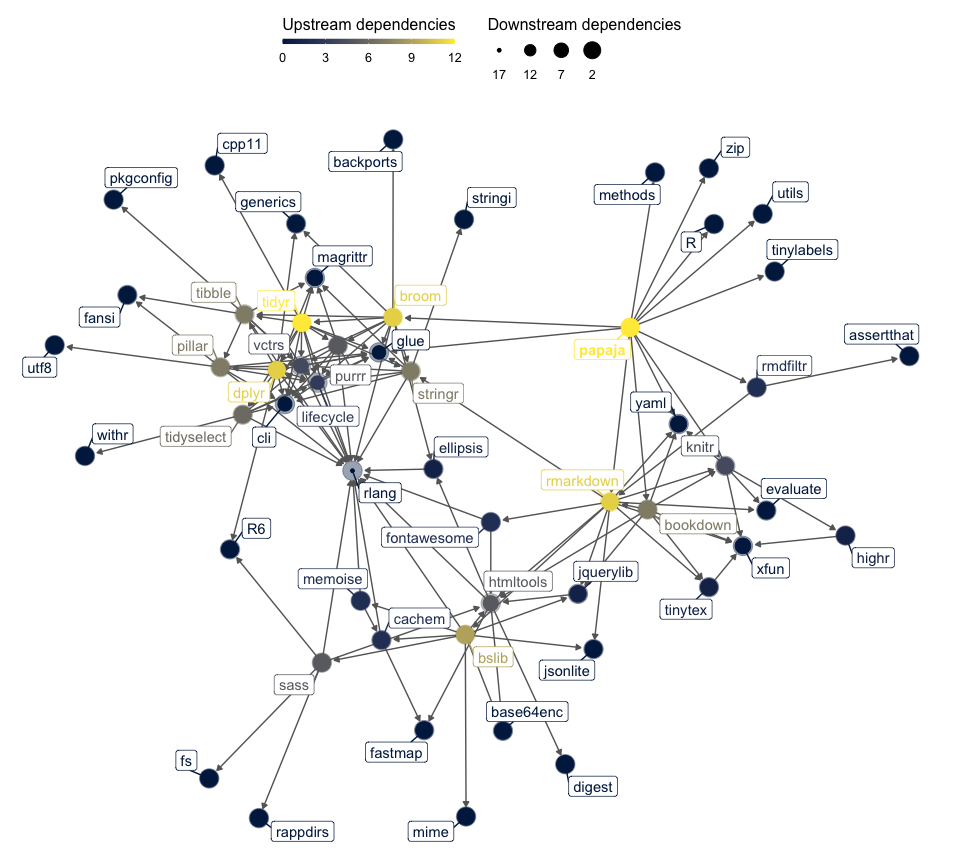

papaja:
Prepare APA Journal Articles<br />with R Markdown
================

<!-- README.md is generated from README.Rmd. Please edit that file -->

[](https://cran.r-project.org/web/packages/papaja/index.html)
[](http://www.repostatus.org/#wip)

[](https://github.com/crsh/papaja/actions)
[](https://codecov.io/gh/crsh/papaja)
[](https://github.com/crsh/papaja/issues?q=is%3Aopen+is%3Aissue+label%3Abug)


**papaja** is an R package that facilitates creating computationally
reproducible, submission-ready manuscripts which conform to the American
Psychological Association (APA) manuscript guidelines (6th Edition).
**papaja** provides

-   an [R Markdown](http://rmarkdown.rstudio.com/) template that can be
    used with (or without) [RStudio](http://www.rstudio.com/) to create
    PDF documents (using the [apa6](http://www.ctan.org/pkg/apa6) LaTeX
    class) or Word documents (using a .docx-reference file).
-   Functions to **typeset** the results from **statistical analyses**,
-   functions to create **tables**, and
-   functions to create **figures** in accordance with APA guidelines.

For a comprehensive introduction to **papaja**, check out the current
draft of the [**papaja** manual](https://crsh.github.io/papaja_man/). If
you have a specific question that is not answered in the manual, feel
free to ask a question on Stack Overflow [using the **papaja**
tag](https://t.co/Z3auyUrbTa). If you believe you have found a bug or
you want to request a new feature, [open an
issue](https://github.com/crsh/papaja/issues) on Github and provide a
[minimal complete verifiable
example](https://stackoverflow.com/help/mcve).

## Example

Take a look at the [R Markdown
file](https://github.com/crsh/papaja/blob/master/inst/example/example.rmd)
of the example manuscript in the folder `example` and the resulting
[PDF](https://raw.githubusercontent.com/crsh/papaja/master/inst/example/example.pdf).
The example document also contains some basic instructions.

## Installation

To use **papaja** you need either a recent version of
[RStudio](http://www.rstudio.com/) or
[pandoc](http://johnmacfarlane.net/pandoc/). If you want to create PDF-
in addition to DOCX-documents you additionally need a
[TeX](http://de.wikipedia.org/wiki/TeX) distribution. We recommend you
use [TinyTex](https://yihui.name/tinytex/), which can be installed from
within R:

``` r
if(!"tinytex" %in% rownames(installed.packages())) install.packages("tinytex")

tinytex::install_tinytex()
```

You may also consider [MikTeX](http://miktex.org/) for Windows,
[MacTeX](https://tug.org/mactex/) for Mac, or [TeX
Live](http://www.tug.org/texlive/) for Linux. Please refer to the
[**papaja**
manual](https://crsh.github.io/papaja_man/introduction.html#getting-started)
for detailed installation instructions.

**papaja** is not yet available on CRAN but you can install it from this
repository:

``` r
# Install remotes package if necessary
if(!"remotes" %in% rownames(installed.packages())) install.packages("remotes")

# Install the stable development version from GitHub
remotes::install_github("crsh/papaja")

# Install the latest development snapshot from GitHub
remotes::install_github("crsh/papaja@devel")
```

## Usage

Once **papaja** is installed, you can select the APA template when
creating a new R Markdown file through the RStudio menus.


To add citations, specify your bibliography-file in the YAML front
matter of the document (`bibliography: my.bib`) and start citing (for
details, see pandoc manual on the [citeproc
extension](https://pandoc.org/MANUAL.html#extension-citations). You may
also be interested in [**citr**](https://github.com/crsh/citr), an R
Studio addin to swiftly insert Markdown citations and [R Studio’s visual
editor](https://rstudio.github.io/visual-markdown-editing/), which also
enables swiftly [inserting
citations](https://rstudio.github.io/visual-markdown-editing/citations.html).

### Typeset analysis results

The functions `apa_print()` and `apa_table()` facilitate reporting
results of your analyses. When you pass the an output object of a
supported class, such as an `htest`- or `lm`-object, to `apa_print()`,
it will return a list of character strings that you can use to report
the results of your analysis.

``` r
my_lm <- lm(
  Sepal.Width ~ Sepal.Length + Petal.Width + Petal.Length
  , data = iris
)
apa_lm <- apa_print(my_lm)

apa_lm$full_result$Sepal_Length
```

    ## [1] "$b = 0.61$, 95\\% CI $[0.48, 0.73]$, $t(146) = 9.77$, $p < .001$"

**papaja** currently provides methods for the following object classes:

| A-B                            | B-L                           | L-S               | S-Z                       |
|:-------------------------------|:------------------------------|:------------------|:--------------------------|
| afex\_aov                      | BFBayesFactorTop<sup>\*</sup> | lme               | summary.aov               |
| anova                          | default                       | lsmobj            | summary.aovlist           |
| anova.lme                      | emmGrid                       | manova            | summary.glht<sup>\*</sup> |
| Anova.mlm                      | glht<sup>\*</sup>             | merMod            | summary.glm               |
| aov                            | glm                           | mixed             | summary.lm                |
| aovlist                        | htest                         | papaja\_wsci      | summary.manova            |
| BFBayesFactor<sup>\*</sup>     | list                          | summary\_emm      | summary.ref.grid          |
| BFBayesFactorList<sup>\*</sup> | lm                            | summary.Anova.mlm |                           |

\* Not fully tested, don’t trust blindly!

### Create tables

`apa_table()` may be used to produce publication-ready tables in an R
Markdown document. For instance, you might want to report some condition
means (with standard errors).

``` r
library("dplyr")
npk |>
  group_by(N, P) |>
  summarise(mean = mean(yield), se = se(yield), .groups = "drop") |>
  label_variables(N = "Nitrogen", P = "Phosphate", mean = "*M*", se = "*SE*") |>
  apa_table(caption = "Mean pea yield (with standard errors)")
```

Table 1. *Mean pea yield (with standard errors)*

| Nitrogen | Phosphate |  *M*  | *SE* |
|:--------:|:---------:|:-----:|:----:|
|    0     |     0     | 51.72 | 1.88 |
|    0     |     1     | 52.42 | 2.65 |
|    1     |     0     | 59.22 | 2.66 |
|    1     |     1     | 56.15 | 2.08 |

This is a fairly simple example, but `apa_table()` may be used to
generate [more complex tables](https://osf.io/s4968/).

`apa_table()`, of course, plays nicely with the output from
`apa_print()`. Thus, it is possible to conveniently report complete
regression tables, ANOVA tables, or the output from mixed-effects
models.

``` r
lm(Sepal.Width ~ Sepal.Length + Petal.Width + Petal.Length, data = iris) |>
  apa_print() |>
  apa_table(caption = "Iris regression table.")
```

Table 2. *Iris regression table.*

| Predictor    |   *b* |      95% CI      | *t*(146) |       *p* |
|:-------------|------:|:----------------:|---------:|----------:|
| Intercept    |  1.04 |  \[0.51, 1.58\]  |     3.85 | &lt; .001 |
| Sepal Length |  0.61 |  \[0.48, 0.73\]  |     9.77 | &lt; .001 |
| Petal Width  |  0.56 |  \[0.32, 0.80\]  |     4.55 | &lt; .001 |
| Petal Length | -0.59 | \[-0.71, -0.46\] |    -9.43 | &lt; .001 |

### Create figures

**papaja** further provides functions to create publication-ready plots.
For example, you can use `apa_barplot()`, `apa_lineplot()`, and
`apa_beeplot()` (or the general function `apa_factorial_plot()`) to
visualize the results of factorial study designs:

``` r
apa_beeplot(
  data = stroop_data
  , dv = "response_time"
  , id = "id"
  , factors = c("congruency", "load")
  , ylim = c(0, 800)
  , dispersion = wsci # within-subjects confidence intervals
  , conf.level = .99
  , las = 1
)
```


If you prefer creating your plots with `ggplot2`, try `theme_apa()`.

``` r
library("ggplot2")
library("ggforce")

p <- ggplot(
  stroop_data
  , aes(x = congruency, y = response_time, shape = load, fill = load)
) +
  geom_violin(alpha = 0.2, color = grey(0.6)) +
  geom_sina(color = grey(0.6)) +
  stat_summary(position = position_dodge2(0.95), fun.data = mean_cl_normal) +
  lims(y = c(0, max(stroop_data$response_time))) +
  scale_shape_manual(values = c(21, 22)) +
  scale_fill_grey(start = 0.6, end = 1) +
  labs(
    x = "Congruency"
    , y = "Response time"
    , shape = "Cognitive load"
    , fill = "Cognitive load"
  )

p + theme_apa()
```

<!-- -->

### Usage without RStudio

Don’t use RStudio? No problem. Use the `rmarkdown::render` function to
create articles:

``` r
# Create new R Markdown file
rmarkdown::draft(
  "mymanuscript.Rmd"
  , "apa6"
  , package = "papaja"
  , create_dir = FALSE
  , edit = FALSE
)

# Render manuscript
rmarkdown::render("mymanuscript.Rmd")
```

## Getting help


For a comprehensive introduction to **papaja**, check out the current
draft of the [**papaja** manual](https://crsh.github.io/papaja_man/). If
you have a specific question that is not answered in the manual, feel
free to ask a question on Stack Overflow [using the **papaja**
tag](https://t.co/Z3auyUrbTa). If you believe you have found a bug or
you want to request a new feature, [open an
issue](https://github.com/crsh/papaja/issues) on Github and provide a
[minimal complete verifiable
example](https://stackoverflow.com/help/mcve).

## Citation

Please cite **papaja** if you use it. You can for example [use
`cite_r()`](https://crsh.github.io/papaja_man/writing.html#citing-r-and-its-packages)
or copy the reference information returned by `citation('papaja')` to
your BibTeX file.

    Aust, F., Barth, M. (2020). papaja: Prepare reproducible APA journal articles with R Markdown. R package version 0.1.0.9997. Retrieved from https://github.com/crsh/papaja

## papaja in the wild

If you are interested to see how others are using **papaja**, you can
find a [collection of
papers](http://frederikaust.com/papaja_man/published-manuscripts.html)
and the corresponding R Markdown files in the manual.

If you have published a paper that was written with **papaja**, please
add the reference to the [public Zotero
group](https://www.zotero.org/groups/2202906/papaja) yourself or send us
to me.

## Computational reproducibility

To ensure mid- to long-term computational reproducibility we highly
recommend conserving the software environment used to write a manuscript
(e.g. R and all R packages) either in a software container or a virtual
machine. This way you can be sure that your R code does not break
because of updates to R or any R package. For a brief primer on
containers and virtual machines see [the supplementary
material](https://psych-transparency-guide.uni-koeln.de/analytic-reproducibility.html#document-hardware-and-software-used-for-analyses)
by Klein et al. (2018).

[Docker](https://www.docker.com/) is the most widely used
containerization approach. It is open source and free to use but
requires some disk space. [CodeOcean](https://codeocean.com/) is a
commercial service that builds on Docker, facilitates setting up and
sharing containers and lets you run computations in the cloud. See the
**papaja** manual on [how to get started using **papaja** with Docker or
CodeOcean](https://crsh.github.io/papaja_man/tips-and-tricks.html#reproducible-software-environments).

## Contribute

[](https://github.com/crsh/papaja/issues?q=is%3Aopen+is%3Aissue+label%3A%22help+wanted%22)
[](https://github.com/crsh/papaja/issues?q=is%3Aopen+is%3Aissue+label%3Adocumentation)

Like **papaja** and want to contribute? We highly appreciate any
contributions to the R package or its documentation. Take a look at the
[open issues](https://github.com/crsh/papaja/issues) if you need
inspiration. There are also many additional analyses that we would like
`apa_print()` to support. Any new S3/S4-methods for this function are
always appreciated (e.g., `factanal`, `fa`, `lavaan`).

## Related R packages

By now, there are a couple of R packages that provide convenience
functions to facilitate the reporting of statistics in accordance with
APA guidelines.

-   [**apa**](https://github.com/dgromer/apa): Format output of
    statistical tests in R according to APA guidelines
-   [**APAstats**](https://github.com/achetverikov/APAstats): R
    functions for formatting results in APA style and other stuff
-   [**sigr**](https://github.com/WinVector/sigr): Concise formatting of
    significances in R
-   [**apaTables**](https://github.com/dstanley4/apaTables): Create
    American Psychological Association (APA) Style Tables

If you are looking for other journal article templates, you may be
interested in the [**rticles**](https://github.com/rstudio/rticles)
package.

## Package dependencies

<!-- -->
