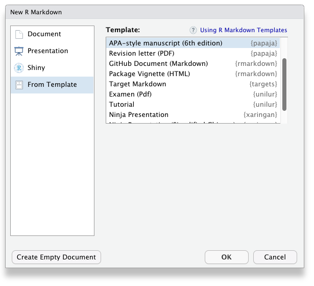

```{r message = FALSE, warning = FALSE}
library("papaja")
library("dplyr")
library("afex")

load("../tests/testthat/data/mixed_data.rdata")
```

# What is papaja?
As you may have heard, recently, interest in reproducible research has been growing.
Reproducible data analysis is an easy to implement and important aspect of the strive towards reproducibility.
For *R* users, R Markdown has been suggested as one possible framework for reproducible analyses.
`papaja` is a R-package in the making including a [R Markdown](http://rmarkdown.rstudio.com/) template that can be used with (or without) [RStudio](http://www.rstudio.com/) to produce documents, which conform to the American Psychological Association (APA) manuscript guidelines (6th Edition).
The package uses the \LaTeX document class [apa6](http://www.ctan.org/pkg/apa6) and a .docx-reference file, so you can create PDF documents, or Word documents if you have to.
Moreover, `papaja` supplies R-functions that facilitate reporting results of your analyses in accordance with APA guidelines.

Markdown is a simple formatting syntax that can be used to author HTML, PDF, and MS Word documents (among others).
In the following I will assume you have hopped onto the band wagon and know how to use R Markdown to conduct and comment your analyses.
If this is not the case, I recommend you get to grips with [R Markdown](http://R Markdown.rstudio.com/) first.
I use [RStudio](http://www.rstudio.com/) (which makes use of [pandoc](http://johnmacfarlane.net/pandoc/)) to create my documents, but the general process works using any other text editor.


# How to use papaja
Once you have installed `papaja` and all other [required software](https://github.com/crsh/papaja), you can select the APA template when creating a new Markdown file through the RStudio menus, see \autoref{fig:menu}.
When you click RStudio's *Knit* button (see \autoref{fig:knit}), `papaja`, `R Markdown,` and `knitr` work together to create an APA conform manuscript that includes both your text and the output of any embedded R code chunks within the manuscript.




## Printing R output
Any output from R is included as you usually would using R Markdown.
By default the R code will not be displayed in the final documents.
If you wish to show off your code you need to set `echo = TRUE` in the chunk options.

```{r echo = TRUE, results = 'markup'}
summary(mixed_data)
```

But, surely, this is not what you want your submission to look like.

### Print tables
For prettier tables, I suggest you try `apa_table()`, which builds on `knitr`'s `kable()`.

```{r results = 'asis', echo = TRUE}
descriptives <- mixed_data %>% group_by(Dosage) %>%
  summarize(
    Mean = mean(Recall)
    , Median = median(Recall)
    , SD = sd(Recall)
    , Min = min(Recall)
    , Max = max(Recall)
  )
descriptives[, -1] <- printnum(descriptives[, -1])

apa_table(
  descriptives
  , caption = "Descriptive statistics of correct recall by dosage."
  , note = "This table was created with apa_table()"
  , escape = TRUE
)
```

Of course popular packages like `xtable`[^xtable] or `tables` can also be used to create tables when knitting PDF documents.
These packages, however, cannot be used when you want to create Microsoft Word documents because they rely on \LaTeX for typesetting.
`apa_table()` creates tables that conform to APA guidelines and are correctly rendered in PDF and Word documents.
But don't get too excited.
In papaja, table formatting is somewhat limited for Word documents due to missing functionality in pandoc (e.g., it is not possible to have cells or headers span across multiple columns).

[^xtable]: When you use `xtable()`, table captions are [set to the left page margin](http://tex.stackexchange.com/questions/42209/centering-tables-in-document-class-apa6).

As required by the APA guidelines, tables are deferred to the final pages of the manuscript when creating a PDF.
To place tables and figures in your text instead, set the `figsintext` parameter in the YAML header to `yes` or `true`, as I have done in this document.
Again, this is not the case in Word documents due to limited pandoc functionality.
The bottom line is, Word documents will be less polished than PDF.
The resulting documents should suffice to enable collaboration with Wordy colleagues and prepare a journal submission with limited manual labor.

### Embed plots
As usual in R Markdown, you can embed R-generated plots into your document, see \autoref{fig:bee}.

```{r fig.cap = "Bee plot of the example data set. Small points represent individual observations, large points represent means, and error bars represent 95% confidence intervals. \\label{fig:bee}", echo = TRUE, dev.args = list(bg = 'white')}
apa_beeplot(
  mixed_data
  , id = "Subject"
  , dv = "Recall"
  , factors = c("Task", "Valence", "Dosage")
  , dispersion = conf_int
  , ylim = c(0, 30)
  , las = 1
  , args_points = list(cex = 1.5)
  , args_arrows = list(length = 0.025)
)
```

Again, as required by the APA guidelines, figures are deferred to the final pages of the document unless you set `figsintext` to `yes`.

### Referencing figures and tables
Currently, `rmarkdown` does not support proper cross-referencing with the document.
For this document, I have simply interspersed my R markdown document with \LaTeX to accomplish cross-references.
A new version of pandoc (1.16), that is not *yet* shipped with RStudio, supports proper cross-referencing that will work with Word documents as well.

### Report statistical analyses
`apa_print()` will help you report the results of your statistical analyses.
The function will format the contents of R objects and produce readily reportable text.

```{r echo = TRUE}
recall_anova <- afex::aov_car(
  Recall ~ (Task * Valence * Dosage) + Error(Subject/(Task * Valence)) + Dosage
  , data = mixed_data
  , type = 3
)
recall_anova_results <- apa_print(recall_anova, es = "pes")
recall_anova_results_p <- apa_print(recall_anova, es = "pes", in_paren = TRUE)
```

Now, you can report the results of your analyses like so:

```{r eval = FALSE, echo = TRUE}
Item valence (`r anova_results_p$full$Valence`) and the task affected recall
performance, `r anova_results$full$Task`; the dosage, however, had no effect
on recall, `r anova_results$full$Dosage`. There was no significant interaction.
```

> Item valence (`r recall_anova_results_p$full$Valence`) and the task affected recall performance, `r recall_anova_results$full$Task`;
> the dosage, however, had no effect on recall, `r recall_anova_results$full$Dosage`.
> There was no significant interaction.

What's even more fun, you can easily create a complete ANOVA table using by passing `recall_anova_results$table` to `apa_table()`, see \autoref{ref:anova}.

```{r results = "asis", echo = TRUE}
apa_table(
  recall_anova_results$table
  , align = c("l", "r", "c", "r", "r", "r")
  , caption = "ANOVA table for the analyis of the example data set. \\label{ref:anova}"
  , note = "This is a table created using apa\\_print() and apa\\_table()."
)
```


## Citations
No manuscript is complete without citation.
In order for citations to work, you need to supply a .bib-file to the `bibliography` parameter in the YAML front matter.
Once this is done, `[e.g., @james_1890; @bem_2011]` produces a regular citation within parentheses [e.g., @james_1890; @bem_2011].
To cite a source in text simply omit the brackets; for example, write `@james_1890` to cite @james_1890.
For other options see the [overview of the R Markdown citation syntax](http://rmarkdown.rstudio.com/authoring_bibliographies_and_citations.html).
If you use RStudio, I have created an [easy-to-use add-in](https://github.com/crsh/citr) that facilitates inserting citations.
The relevant references will, of course, be added to the documents reference section automatically.

I think it is important to credit the software we use.
A lot of R packages are developed by academics free of charge.
As citations are the currency of science, it's easy to compensate volunteers for their work by citing the R packages we use.
I suspect that, among other things, this is rarely done because it is tedious work.
That's why papaja makes citing R and its packages easy:

```{r echo = TRUE}
r_refs(file = "r-references.bib")
my_citation <- cite_r(file = "r-references.bib")
```

`r_refs()` creates a BibTeX file containing citations for R and all currently loaded packages.
`cite_r()` takes these citations and turns them into readily reportable text.
`my_citation` now contains the following text that you can use in your document: `r my_citation`

The citation style is automatically set to APA style.
If you need to use a different citation style, you can set in the YAML front matter by adding a `csl` parameter.
See the [R Markdown documentation](http://R Markdown.rstudio.com/authoring_bibliographies_and_citations.html) and [Citation Style Language](http://citationstyles.org/) for further details.

## Math
If you need to report formulas, you can use the flexible \LaTeX syntax (it will work in Word documents, too).
Inline math must be enclosed in `$` or `\(` and `\)` and the result will look like this: $d' = z(H) - z(FA)$.
For larger formulas displayed equations are more appropriate; they are enclosed in `$$` or `\[`and `\]`,

$$
d' = \frac{\mu_{old} - \mu_{new}}{\sqrt{0.5(\sigma^2_{old} + \sigma^2_{new})}}.
$$


## Document options
This text is set as manuscript.
If you want a thesis-like document you can change the `class` in the YAML front matter from `man` to `doc`.
You can also preview a polished journal typesetting by changing the `class` to `jou`.
Refer to the `apa6` document class [documentation](ftp://ftp.fu-berlin.de/tex/CTAN/macros/latex/contrib/apa6/apa6.pdf) for further `class` options, such as paper size or draft watermarks.

When creating PDF documents, line numbering can be activated by setting the `lineno` argument in the YAML front matter to `yes`.
Moreover, you can create lists of figure or table captions at the end of the document by setting `figurelist` or `tablelist` to `yes`, respectively.
These option have no effect on Word documents.

## Last words
That's all I have. Enjoy writing your manuscript. If you have any trouble or ideas for improvements, open an [issue](https://github.com/crsh/papaja/issues) on GitHub or open a pull request.
If you want to contribute, take a look at the [open issues](https://github.com/crsh/papaja/issues) if you need inspiration.
Other than that, there are many output objects from analysis methods that we would like `apa_print()` to support.
Any new S3-method for this function are always appreciated (e.g., `glm`, `factanal`, `fa`, `lavaan`, `BFBayesFactor`).

# References

<!-- These lines ensure references are set with hanging indents in PDF documents; they are ignored in Word. -->
\setlength{\parindent}{-0.5in}
\setlength{\leftskip}{0.5in}
